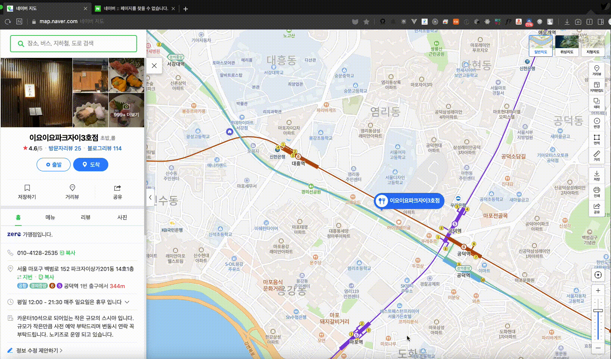

# 기여 방법

- 업장을 추가하기 전에 중복된 업장이 목록에 있는지 검색합니다.
- 가격대별 분류 기준에 맞게 스시야를 추가하고 Pull Request를 생성합니다.
- 다음 형식을 따라주세요.

```
#### [`스시야 이름`](네이버 장소 링크)

- 위치
- 가격
- 예약
- 특징
- SNS
```

- 특징과 SNS는 생략해도 무방합니다.
- 오타가 없는지 확인해주세요.
- 공백이 일관적인지 확인해주세요.

기여해주셔서 감사드립니다. :)


### 네이버 장소 링크 찾는 법

[관련 이슈](https://github.com/738/awesome-sushi/issues/25)

1. [네이버 맵](http://map.naver.com/)에 접속하여 원하는 장소를 찾는다.
2. URL에서 PlaceID를 찾는다.
3. 찾은 PlaceID를 https://store.naver.com/restaurants/detail?id= 뒤에 붙여넣는다.



